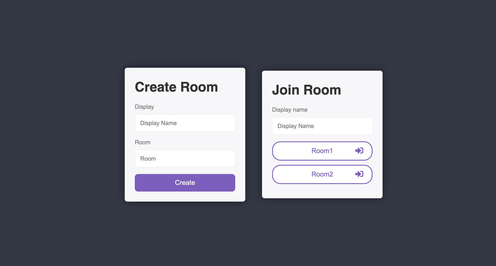
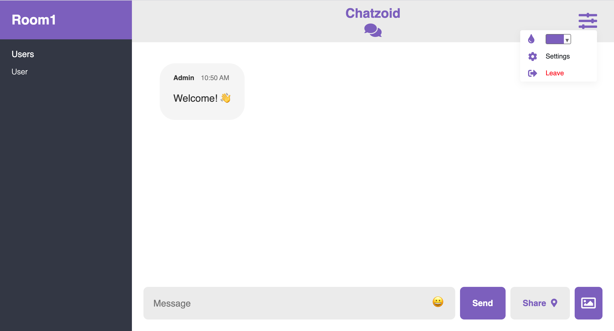

# 💬 Chatzoid

Chatzoid is a real-time chat application that sends and shows messages to all of the room members instantly without any page refresh.

## ✨ Features

- Create and join rooms 🏠
- Send emojis 😃
- Upload images 🖼️
- Share location 📍
- Change the color theme 🌈

## 🕹️ Installation

Use the package manager [npm](https://www.npmjs.com/) to install the dependencies.

```bash
npm install
```

To run the development server:

```bash
npm run dev
```

To run sass compiling:

```bash
npm run scss
```

## 🖥️ Technologies Used

Front-end: HTML5, SASS, Vanilla JS  
Back-end: NodeJS + Express  
Miscellaneous: Socket.io

## Preview



